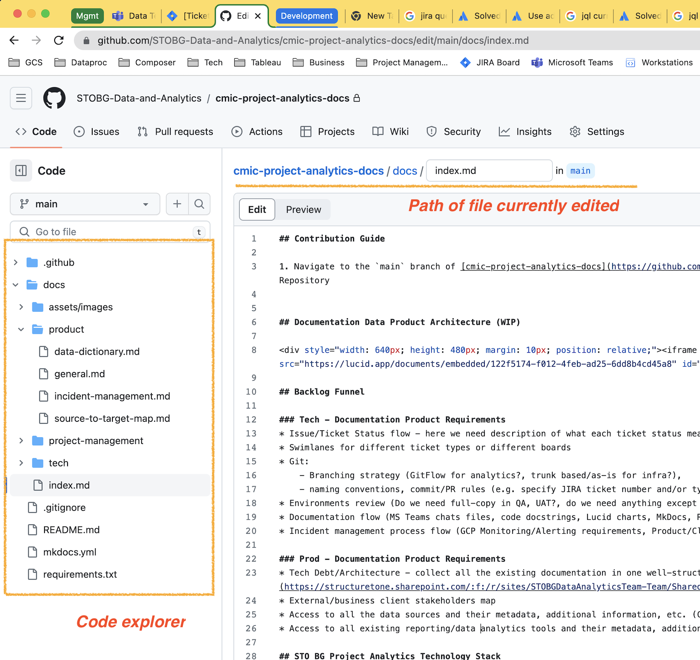
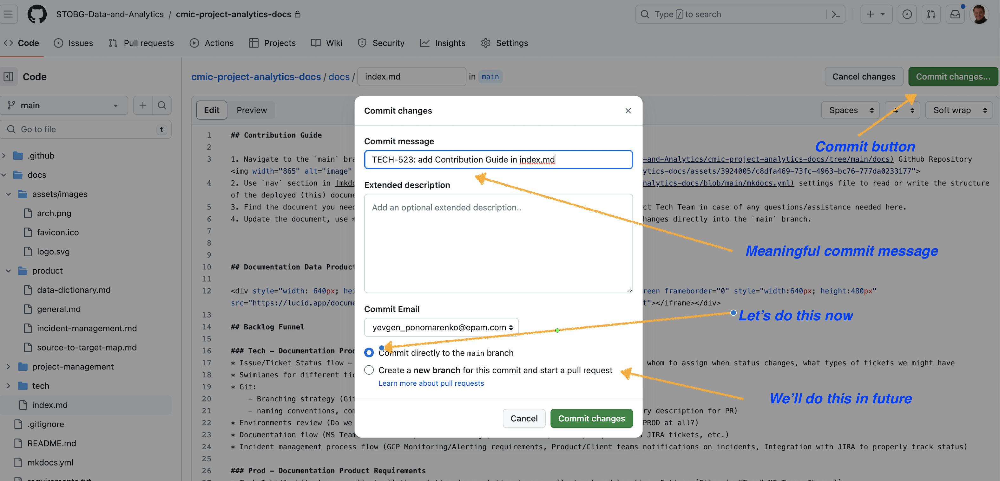
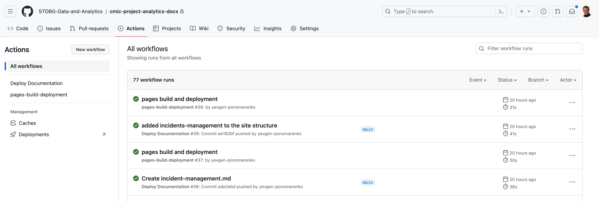

# Documentation Product

The **Documentation Product** is static web-site built by using [Material for MkDocs](https://squidfunk.github.io/mkdocs-material/) Documentation Tool and deployed on GitHub pages via CI/CD pipeline implemented in [GitHub Actions Workflows](https://github.com/STOBG-Data-and-Analytics/cmic-project-analytics-docs/actions).

To search for specific documentation please use Searh feature https://squidfunk.github.io/mkdocs-material/plugins/search/ as well as left navigation menu.

## Documentation Product Architecture (WIP)

<iframe allowfullscreen frameborder="0" style="width:640px; height:480px" src="https://lucid.app/documents/embedded/122f5174-f012-4feb-ad25-6dd8b4cd45a8" id="iGwfQh-b8yOt"></iframe>

## Contribution Guide

1. Navigate to the `main` branch of [cmic-project-analytics-docs](https://github.com/STOBG-Data-and-Analytics/cmic-project-analytics-docs/tree/main/docs) GitHub Repository. 

\[Click to see screenshot\]

2. Use `nav` section in [mkdocs.yml](https://github.com/STOBG-Data-and-Analytics/cmic-project-analytics-docs/blob/main/mkdocs.yml) settings file to read or write the structure of the deployed (this) documentation site.
3. Find the document you need or create the new one and update `nav` section accordingly. Contact Tech Team in case of any questions/assistance needed here.
4. Update the document, use **'Preview'** to see your changes, and once completed commit your changes directly into the `main` branch. 

\[Click to see screenshot\]

5. CI/CD workflow is configured using [GitHub actions](https://github.com/STOBG-Data-and-Analytics/cmic-project-analytics-docs/actions). 

\[Click to see screenshot\]

6. In case of any errors there please contact Tech team. Otherwise your site to be deployed here.

> TODO: Add contribution guide for images, embeddings, etc.

### KT sessions

    
2023-07-25 Tech Design Session

    <iframe src="https://structuretone.sharepoint.com/sites/STOBGDataAnalyticsTeam-Team/_layouts/15/embed.aspx?UniqueId=2f9de736-2e54-4343-9b0b-86c3c80e13bd&embed=%7B%22ust%22%3Atrue%2C%22hv%22%3A%22CopyEmbedCode%22%7D&referrer=StreamWebApp&referrerScenario=EmbedDialog.Create" width="853" height="480" frameborder="0" scrolling="no" allowfullscreen title="20230725_STOBG Tech Desig Session - Documentation and Workato.mp4"></iframe>

