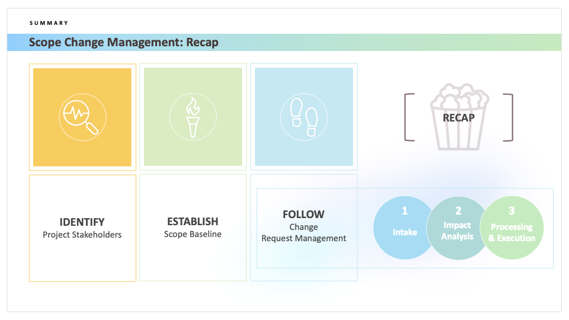

# Scope Change Management

## Summary

**Scope Change Management** is a vital process in project management to ensure that any proposed changes to the project scope are identified, assessed, and handled effectively. This process is in alignment with best practices provided by PMBOK (Project Management Body of Knowledge) and DMBoK (Data Management Body of Knowledge).

## Identify

### Project Stakeholders

The first step in change management is identifying all project stakeholders. These are individuals or groups who:
 - Have a vested interest in the outcome of the project.
 - Are affected by the project.
 - Can influence the project.

Knowing the stakeholders is crucial as they can provide valuable input, identify potential issues, and help in managing and communicating changes effectively.

## Establish

### Scope Baseline

The second step is to establish the project's scope baseline. The scope baseline is a key project document that includes:
  - Project scope statement.
  - Work breakdown structure (WBS).
  - WBS dictionary.

It serves as a reference point against which project performance is measured and project changes are controlled. Establishing a scope baseline ensures that any changes are measured and managed effectively.

## Follow

### Change Request Management

Change Request Management involves tracking and processing all changes to the project scope. It comprises three main stages:

1. **Intake**:
   - Collect change requests from stakeholders.
   - Ensure that the change requests are documented and logged appropriately.

2. **Impact Analysis**:
   - Analyze the impact of proposed changes on project scope, schedule, cost, quality, and resources.
   - Assess risks associated with the change.

3. **Processing & Execution**:
   - Approve or reject changes based on the impact analysis.
   - If approved, update the relevant project documents and communicate the change to all stakeholders.
   - Implement and execute the change as per the approved plan.

## Recap

Summarizing the above stages ensures a structured approach to managing changes in project scope. By identifying stakeholders, establishing a clear scope baseline, and following a well-defined change management process (Intake, Impact Analysis, Processing & Execution), project teams can effectively manage scope changes, minimizing disruptions and enhancing project success.