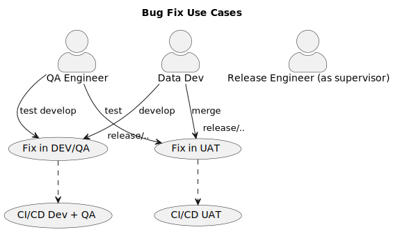

# Release Management

!!! warning
    This page is given as example of integration with [MkDocs-Build-Plantuml-Plugin](https://github.com/quantorconsulting/mkdocs_build_plantuml) and draw.io

Release Types:

* Sprint Release  - promoted to PROD by the end of each Sprint. Name pattern - `<Sprint Name> Release`, e.g. **2025.01.S1 Release**
* Mid-quater and Quater Release (Product Driven) - promoted to PROD by the mid and end of each quater (~3 Sprints). Name pattern - `<YEAR>.<QUARTER>.R<RELEASE_NUMBER>`, e.g. **2025.Q1.R1**
* Ad-hoc release, **>TBD**, e.g. **2025.Q1.Product_Dashboard_Release**


## ETL/ELT Sprint Release Process

* **GitHub Repository** - **<REPO_LINK>**
* **PROD Releases Schedule** - bi-weekly Sprint End Date +- 2 b/d

### ETL Release: Release Engineer activities Sprint timeline diagram


### ETL Release: Use case diagram 


### (GitFlow) Branching Strategy 

GitFlow is a branching model that supports multiple environments such as Development (DEV), Quality Assurance (QA), User Acceptance Testing (UAT), and Production (PROD). In this workflow, the process of integrating your code changes with the main code base and deploying it to various environments is facilitated through a Continuous Integration (CI) and Continuous Delivery (CD) pipeline. 

Following this CI/CD process using GitFlow, your team can achieve an efficient workflow that enables continuous integration, testing, and deployment across multiple environments: DEV, QA, UAT, and PROD. This ensures code quality, helps minimize risk, and accelerates the speed of software delivery.

Here's an overview of the CI/CD process using GitFlow for the mentioned deployment environments.

#### Branch types and naming conventions:

* `main`: The production-ready code.
* `develop`: The main branch for development, where all developers merge their work.
* `feature`: Branches for new features, branching from and merging back to develop. Feature Git branch names should be prefixed with type of work as `(feat|fix|refactoring|chore)/<JIRA_TICKET_ID>/<SHORT_DESC>` where:
    * feat - is a feature (i.e. user story)
    * fix - is a fix of bug found in non-PROD environment
    * refactoring - refactoring tickets
    * chore - something that doesn't fall into above categories (e.g. documentation, code clean-up, comments, etc.). We prefer to not commit anything without a JIRA ticket but if the exception is reasonable then those branches shoud use `TECH-0000` instead of `<JIRA_TICKET_ID>`
* `releases`: Branches for release preparation, branching from develop and merging back to main and develop. Naming - `releases/<RELEASE_ID>`
* `hotfix`: Branches for fixing critical production bugs, branching from main and merging back to main and develop. Hotfix branches should include release id in branch name (i.e. `hotfix/<RELEASE_ID>/<JIRA_TICKET_ID>/<SHORT_DESC>`)

### (GitFlow) Enviromments

1. **Development (DEV)**: Developers create new feature branches from the `develop` branch and work on their tasks individually. Once done, developers submit a Pull Request (PR) to merge their code changes back into the develop branch.

2. **Quality Assurance (QA)**: Once the PR is merged into the `develop` branch, QA engineers can deploy the latest version of the code from the develop branch to the QA environment for functional, performance, and security testing.

3. **User Acceptance Testing (UAT)**: If the tests are successful in the QA environment, a release branch is created from the `develop` branch. The release branch is then deployed to the UAT environment, where stakeholders can test and validate the changes. Any issues identified during this stage should be fixed in the release branch, which triggers the CI process for the fixes.

4. **Production (PROD)**: After successful UAT, the release branch is merged into the `main` branch, and the updated application is ready to be deployed to the Production environment. The CI/CD pipeline ensures that the main branch goes through the complete build, test, and validation stages before deployment.

**Continuous Integration (CI)**: Upon submitting a PR, an automated CI process is triggered. This process includes building the application, running unit tests, and checking code quality using static code analysis tools. If the CI process is successful, the PR can be reviewed and approved by a peer or a senior team member.

**Hotfixes**: If there is a need to fix a critical issue in the production environment, a hotfix branch is created directly from the `main` branch. The hotfix will go through its own CI process and be tested in the QA and UAT environments. Once approved, the hotfix branch is merged back into both `main` and `develop` branches.

### (GitFlow) Data Engineering Happy Path use-cases: 


### (GitFlow) Data Engineering Bug Fix use-cases: 


### (GitFlow) Data Engineering Hotfix use-cases: 


### Development conventions

#### Commits

<u>Rules of thumb:</u>

* Prefix your commits as `TECH-XXX:...`
* Prefer to make more commits and shorter messages

#### Pull Requests

<u>Rules of thumb:</u>

* Prefer "Comment" over "Request Changes"
* Prefix your pull requests as `TECH-XXX:...`
* Provide summary of what was done. Include links on related artifacts (Jira tickets, diagrams, documentation, etc.)
* Use "Squash and Merge" instead of "Merge" for feature branch into develop to keep Git history shorter
* In all other cases use "Merge"
* Delete your branch after merge to base

#### Release to UAT Step-by-Step Example

Consider that you would want to deploy a set of commits found on the `develop` branch to `UAT`.
In terms of this step-by-step guide, the proper deployment of the first sprint's release for 2024 is going to be presented.

1. Create a properly named release branch from the `main` branch. In our example, create the `releases/2025.S1` from the `main` branch.
2. From the GitHub page, create a pull request that merges the `develop` branch to the newly created release branch. In our case, the pull request should have `releases/2025.S1` as base branch. As part of this pull request:
    * Include all team leads along with other legit reviewers. Bear in mind that everyone in this list is considered a legit approver.
    * Write a descriptive list of all the user stories delivered in terms of this release. Specifically, include:
        - The link to the corresponding JIRA Release, if any
        - The list of all user stories delivered, as a list of properly named links to the corresponding JIRA ticket numbers.
        - The list of all possible detected defects founds during the QA phase.
        - A proper example of a descriptive list can be found on the **<LINK_TO_EXAMPLARY_PR>**
3. Once approved, merge the changes. *It should be boldly underlined that changes should be merged and NOT "squashed and merged"*.
4. Go to GitHub's `Actions` tab and check the progress of the automated deployment to UAT.

#### Release to PROD Step-by-Step Example

Consider that you would want to deploy to the `PROD` environment, a set of commits that have been already deployed and tested to `UAT`, 
In terms of this step-by-step guide, the proper deployment of the first sprint's release for 2024 is going to be presented.

1. Having created a proper release branch and automatically deployed to the `UAT` environment, a "UAT sign off" request should be made to PO.
2. Having PO's approval on the aforementioned "UAT sign off" request, create a pull request in GitHub having the `main` branch as base, and the release branch as comparison. In our example's case, this would be `releases/2025.S1`. As in case of the `UAT` release, please include:
    * Include all team leads along with other legit reviewers. Bear in mind that everyone in this list is considered a legit approver.
    * Write a descriptive list of all the user stories delivered in terms of this release along with the Sprint goal objectives. A proper example of a suitable description can be found on the **<LINK_TO_EXAMPLARY_PR>**
3. Once approved, merge the changes. *It should be boldly underlined that changes should be merged and NOT "squashed and merged"*.
4. Go to GitHub's `Actions` tab and communicate the link of the automated deployment to PROD to appropriate stakeholders to approve.

#### Hotfix Release Step-by-Step Example

Consider the case of deploying a hotfix to the `PROD` environment.
In terms of this step-by-step guide, consider the case of delivering the code changes introduced in terms of imaginary ticket **TECH-1234**, which have already been merged to the `develop` branch, while the latest release branch is `releases/2024.S1`.

1. Create a properly named hotfix branch from the latest release branch. In our case, the following GitHub command should be issued:
```
git checkout -b hotfix/2025.S1/TECH-1234/Update-Something releases/2025.S1
```
2. Knowing the commit id of the hotfix, cherry-pick it to the hotfix branch. Specifically in our case, assuming that the requested commit id is `e99c429`, the command that should be issued is the:
```
git cherry-pick e99c429
```
3. Push the changes to make a pull request that should be merged in the latest realase branch that in our case is `releases/2025.S1`.
    * Include all team leads along with other stakeholders as legit reviewers. Bear in mind that everyone in this list is considered a legit approver.
    * Write a descriptive list of all the user stories delivered in terms of this hotfix. A proper example of a descriptive list can be found on the **<LINK_TO_EXAMPLARY_PR>**
4. Once approved, merge the changes. *It should be boldly underlined that changes should be merged and NOT "squashed and merged"*.
5. Go to GitHub's `Actions` tab and check the progress of the automated deployment to UAT.
6. After the necessary smoke testing in the `UAT` environment, make a "UAT sign off" request to PO.
7. Having PO's approval on the "UAT sign off" request, create a pull request in GitHub having the `main` branch as base, and the release branch as comparison. In our example's case, this would be `releases/2025.S1`. As in case of the `UAT` release, please include: 
    * Include all team leads along with other legit reviewers. Bear in mind that everyone in this list is considered a legit approver.
    * Write a descriptive list of all the user stories delivered in terms of this release along with the Sprint goal objectives.
8. Once approved, merge the changes. *It should be boldly underlined that changes should be merged and NOT "squashed and merged"*.
9. Go to GitHub's `Actions` tab and communicate the link of the automated deployment to PROD to either legit stakeholders, since they only have the authority for production deployment.

## BI SDLC / Release Management

!!! tip
    Please refresh with cache reload if you don't see Draw.io embedding below

